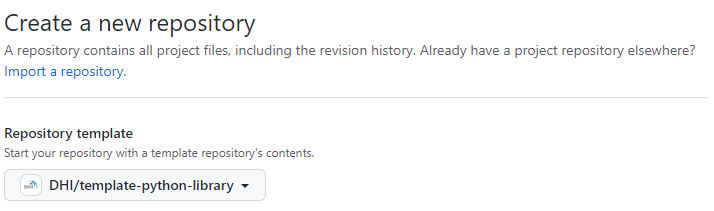

# my_library: Template Python repository

This repository serves as a template for creating a Python library

## How do I use this?

1. Create a new repository in GitHub with this repo as a starting point
    

2. Change all occurences of `my_library` to match the name of your new library