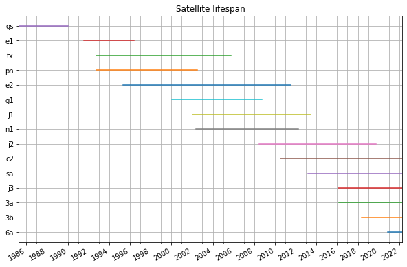

# WatObs: Access Water Observation Data

This Python package gives you convenient access to water observation data with a bring-your-own-api-key concept. 

## Data overview

* DHI satellite [altimetry data](https://altimetry.dhigroup.com/purchase)
* Ocean Observations from [Danish Meteorological Institute](https://confluence.govcloud.dk/display/FDAPI/Danish+Meteorological+Institute+-+Open+Data)

## Example notebooks

* [Altimetry_data](notebooks/Altimetry_data.ipynb)
* [DMI_observations](notebooks/DMI_observations.ipynb)

## Satellite altimetry data 

Altimetry data (water level, significant wave height and wind speed) obtained from satellites are very useful for validation of models as the data are available globally since 1985 and up to 12 hour before now. 

DHI has an [altimetry portal](https://altimetry.dhigroup.com/purchase) with an [api](https://altimetry-shop-data-api.dhigroup.com/apidoc) where you can download the data. 



### Example

Obtain all altimetry data within 100km from (lon, lat)=(2.9, 55.9) from October 2019.

```python
>>> from watobs import DHIAltimetryRepository
>>> repo = DHIAltimetryRepository(api_key)
>>> data = repo.get_altimetry_data(area="lon=2.9&lat=55.9&radius=100", 
                                   start_time="2019-10-1", 
                                   end_time="2019-11-1")
>>> data.df["longitude","latitude","significant_wave_height"].head()

                         longitude   latitude  significant_wave_height
datetime                                                              
2019-10-01 01:53:30.689   3.780429  55.203699                 1.942423
2019-10-01 01:53:31.633   3.770297  55.260700                 1.892914
2019-10-01 01:53:32.576   3.760148  55.317701                 1.838815
2019-10-01 01:53:33.519   3.749980  55.374701                 1.930273
2019-10-01 01:53:34.463   3.739795  55.431700                 1.952707
```